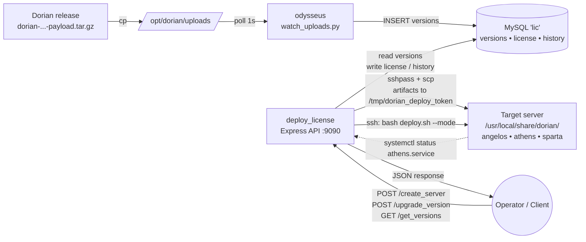
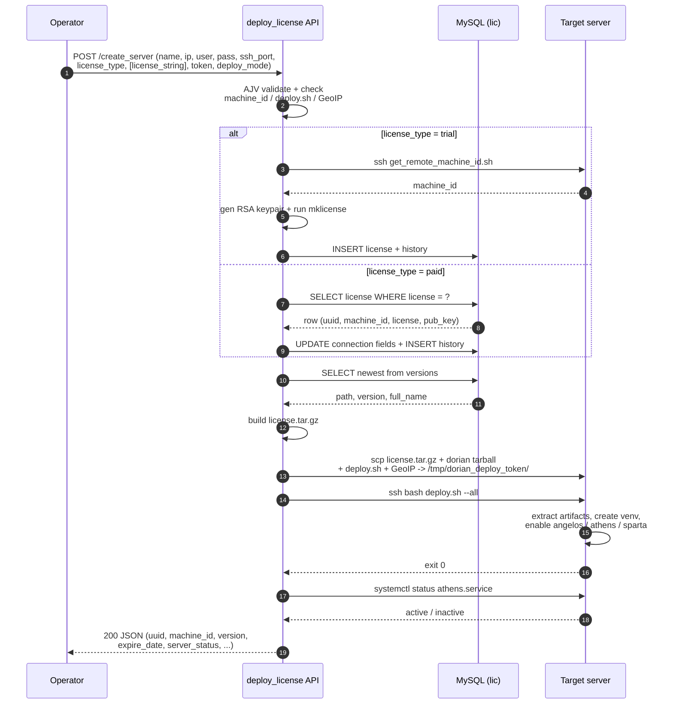
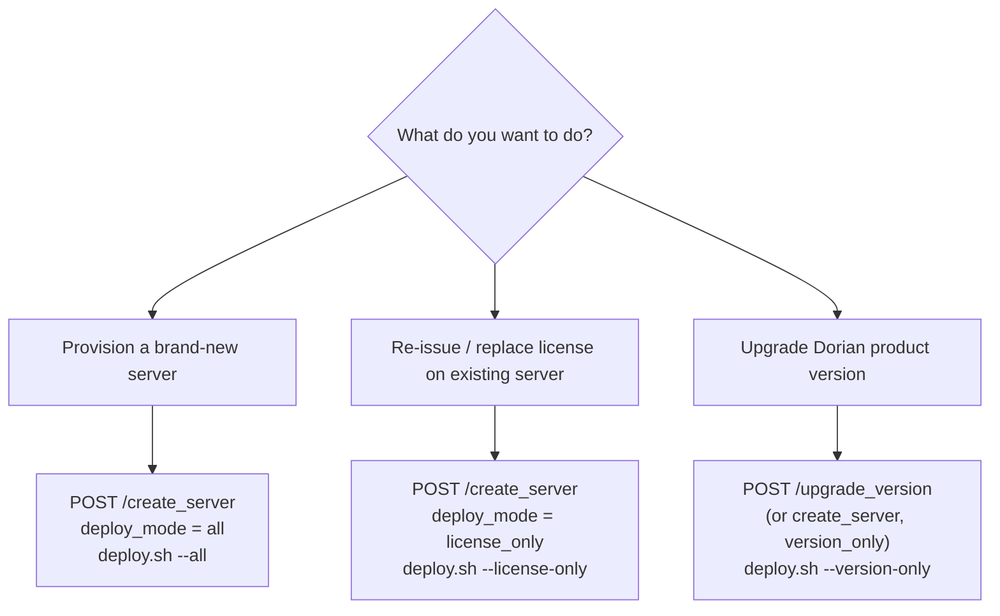

# Provisioning Workflow

End-to-end procedure for taking a fresh Linux host and turning it into a
running Dorian DDoS Firewall server using [`odysseus`](../odysseus) and
[`deploy_license`](./README.md).

Both services share the same MySQL database (`lic`):

- `odysseus` writes to `versions`.
- `deploy_license` reads from `versions` and writes to `license` / `history`.

---

## Actors

| Component        | Role                                                                          |
| ---------------- | ----------------------------------------------------------------------------- |
| `odysseus`       | Polls `/opt/dorian/uploads`, ingests product tarballs into the `versions` table. |
| `deploy_license` | HTTP API that mints the license, uploads artifacts, runs `deploy.sh` remotely. |
| Target server    | The new host being provisioned (SSH password-reachable, sudo-capable Linux).  |

### Architecture at a glance



---

## 0. One-time prerequisites

Run these once per environment, not per server.

1. Create the schema:

   ```bash
   mysql -u root -p < /home/deploy_license/schema.sql
   ```

2. Place the GeoIP archive at:

   ```
   /home/deploy_license/bin/geodb/dbip-full-2026-02.mmdb.tar.gz
   ```

3. Start `deploy_license` (listens on `:9090` by default; Swagger UI at
   `http://<api-host>:9090/docs`):

   ```bash
   cd /home/deploy_license
   npm install
   npm start
   ```

4. Start `odysseus` (foreground or as a systemd unit — see
   [`odysseus/README.md`](../odysseus/README.md)):

   ```bash
   cd /home/odysseus
   source venv/bin/activate
   python watch_uploads.py
   ```

5. Confirm target-server prerequisites:

   - SSH password login works (the API uses `sshpass`).
   - The SSH user is `root` or has `sudo` (deploy.sh writes to
     `/usr/local/share/dorian/` and `/etc/systemd/system/`).
   - `bash`, `tar`, `python3` with `venv`, and `systemd` are installed.

---

## 1. Ingest a Dorian product version

Done once per release.

Drop a tarball into the upload directory on the `odysseus` host:

```bash
cp dorian-ddos-firewall-0.1.2-payload.tar.gz /opt/dorian/uploads/
```

Within ~1 second `odysseus` will:

- SHA-256 the file.
- Rename it to `dorian-ddos-firewall-0.1.2-payload-<sha256>.tar.gz`.
- Upsert a row into `versions` (`uuid = digest`, `path = absolute path`).

Verify:

```bash
curl http://<api-host>:9090/get_versions
```

The newest row is what `/create_server` will pick up by default.

---

## 2. Call `/create_server`

The single API call that provisions a new server. Two variants depending on
whether you want a fresh trial license or want to reuse an existing paid one.

### Sequence



### 2a. Trial license (new server, no existing license)

```bash
curl -X POST http://<api-host>:9090/create_server \
  -H "Content-Type: application/json" \
  -d '{
    "name": "edge-01",
    "ip": "10.0.0.10",
    "user": "root",
    "pass": "<ssh-password>",
    "ssh_port": 22,
    "license_type": "trial",
    "token": "<operator-token>",
    "deploy_mode": "all"
  }'
```

What `deploy_license` does internally:

1. Validate the payload (AJV).
2. Verify that `bin/machine_id`, `bin/deploy.sh`, and the GeoIP archive
   exist on the API host.
3. Run `bin/generate_license.sh`:
   - SSH into the target with `get_remote_machine_id.sh` to read the
     host's `machine_id`.
   - Generate an RSA keypair under
     `bin/licenses/<machine_id>/<UTC-timestamp>/secrets/`.
   - Run `mklicense` to produce `license.lic` (trial duration = 3 days).
4. Insert a row into `license` and append an audit entry to `history`.
5. Pick the newest row from `versions` and resolve `path` on the API host.
6. Build `license.tar.gz` containing the license, public key, and the
   `machine_id` binary.
7. `scp` four files into `/tmp/dorian_deploy_<token>/` on the target:
   - `license.tar.gz`
   - the Dorian product tarball
   - `deploy.sh`
   - `dbip-full-2026-02.mmdb.tar.gz`
8. SSH in and run `bash deploy.sh --all`, which:
   - Extracts the Dorian tarball to `/usr/local/share/dorian/`.
   - Extracts the license into the same prefix.
   - Extracts the GeoIP db to
     `/usr/local/share/dorian/athens/nginx/lua/geoip2`.
   - Creates the `angelos` Python venv and installs `requirements.txt`.
   - Installs and `enable --now`s `angelos.service`, `athens.service`,
     `sparta.service`.
   - Removes the staging dir on success.
9. Probe `systemctl status athens.service` to derive `server_status`
   (`running` / `stopped` / `deployed`).
10. Return JSON, for example:

    ```json
    {
      "description": "Server artifacts uploaded and remote deploy.sh completed",
      "license_type": "trial",
      "version": "0.1.2",
      "expire_date": "2026-05-16T07:00:00.000Z",
      "server_status": "running",
      "uuid": "<license row uuid>",
      "machine_id": "<remote machine_id>",
      "remote_dir": "/tmp/dorian_deploy_<token>",
      "deploy_mode": "all",
      "remote_deploy_flag": "--all",
      "uploaded_files": [
        "license.tar.gz",
        "dorian-ddos-firewall-0.1.2-payload-<sha256>.tar.gz",
        "deploy.sh",
        "dbip-full-2026-02.mmdb.tar.gz"
      ],
      "dorian_version": {
        "version": "0.1.2",
        "full_name": "dorian-ddos-firewall-0.1.2-payload-<sha256>",
        "uuid": "<digest>"
      }
    }
    ```

### 2b. Paid license (reuse an existing license row)

```bash
curl -X POST http://<api-host>:9090/create_server \
  -H "Content-Type: application/json" \
  -d '{
    "name": "edge-01",
    "ip": "10.0.0.10",
    "user": "root",
    "pass": "<ssh-password>",
    "ssh_port": 22,
    "license_type": "paid",
    "license_string": "<value from license.license column>",
    "token": "<operator-token>",
    "deploy_mode": "all"
  }'
```

Differences from the trial path:

- No license is generated. The API looks up the row in `license` by
  `license = ?`, updates the connection fields (name/ip/user/pass/port/token),
  and repackages the stored license + public key.
- Same `scp` + `deploy.sh` flow afterwards.
- Returns `404` if `license_string` does not match any row.

---

## 3. Deploy-mode variants

The optional `deploy_mode` field controls what `bin/deploy.sh` does on the
target.

| `deploy_mode`   | Remote flag       | What runs on target                                       | Typical use                         |
| --------------- | ----------------- | --------------------------------------------------------- | ----------------------------------- |
| `all` (default) | `--all`           | Dorian tarball + license + GeoIP + venv + systemd         | Brand-new server                    |
| `license_only`  | `--license-only`  | Unpack `license.tar.gz` only (no venv, no systemd)        | Re-license an existing install      |
| `version_only`  | `--version-only`  | Dorian tarball + venv + systemd (no license, no GeoIP)    | Upgrade product version on a server |



---

## 4. Upgrading an existing server (later)

Once a server already has a license, upgrades only need the product tarball.

1. Drop a new tarball into `/opt/dorian/uploads/`. `odysseus` ingests it.
2. Find its UUID:

   ```bash
   curl http://<api-host>:9090/get_versions
   ```

3. Trigger the upgrade:

   ```bash
   curl -X POST http://<api-host>:9090/upgrade_version \
     -H "Content-Type: application/json" \
     -d '{
       "name": "edge-01",
       "ip": "10.0.0.10",
       "user": "root",
       "pass": "<ssh-password>",
       "ssh_port": 22,
       "token": "<operator-token>",
       "version_uuid": "<uuid from /get_versions>"
     }'
   ```

This runs `deploy.sh --version-only` on the target — license is not touched,
services are reloaded.

---

## 5. Post-provision checks

On the target host:

```bash
systemctl status athens.service angelos.service sparta.service
ls /usr/local/share/dorian/
```

On the API host:

```bash
tail -f /home/deploy_license/logs/<ip>__<token>.log
```

Per-session events recorded include `create_server_received`,
`generate_license_failed` (if any), and `create_server_completed`.

In the database:

```sql
SELECT uuid, name, ip, machine_id, expire_date, updated
FROM license
ORDER BY updated DESC
LIMIT 5;

SELECT uuid, description
FROM history
ORDER BY id DESC
LIMIT 5;
```

---

## TL;DR sequence

1. **One-time**: `mysql < schema.sql`, start `deploy_license`, start
   `odysseus`, place the GeoIP archive.
2. **Per release**: drop the product tarball into `/opt/dorian/uploads/`.
   `odysseus` records it in `versions`.
3. **Per server**: `POST /create_server` with target SSH credentials. The
   API generates the license, ships the artifacts, runs `deploy.sh --all`,
   and reports `server_status`.
4. **Per upgrade**: `POST /upgrade_version` with a `version_uuid` from
   `/get_versions`.
5. **Verify**: `GET /health` on the API, `systemctl status athens.service`
   on the target, and the latest rows in `license` / `history`.
